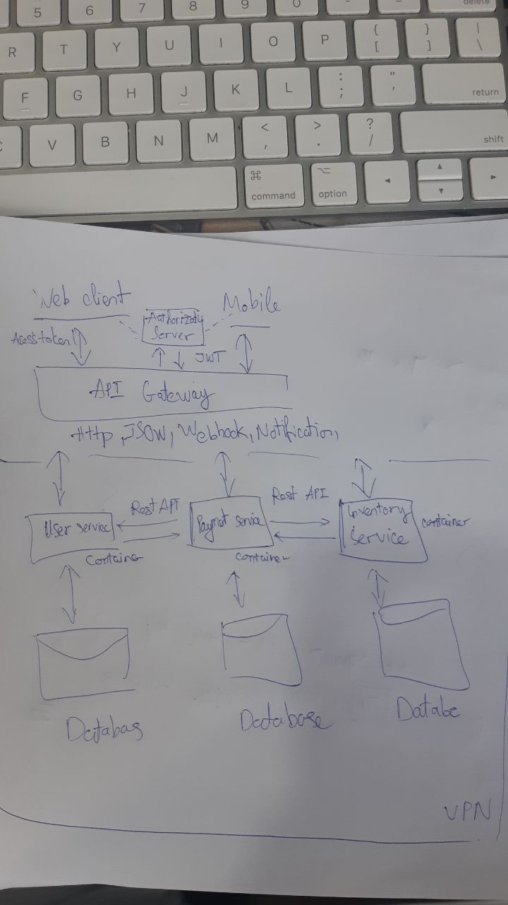

# vcsc-ci

[](https://coveralls.io/github/ltthang88/vcsc-ci?branch=main)

# Báo cáo tiến độ bài Test - 02/06/2021 

**Câu 1:** Em viết thành api find-square, chưa tích hợp kịp swagger vào, nên em gửi curl
```
curl --request GET \
  --url 'http://localhost:3000/find-square?area=12'
```

#
**Câu 2:**  Em sử dụng Github Action, để build code, và coverage lên https://coveralls.io/.
<br>File **.coveralls.yml** chưa tìm được cách sử dụng được biến secret COVERALLS_REPO_TOKEN, trong Environments, do mình không được public token này lên github.<br>

Mong muốn tổ chức commit code theo git-flow, em có demo release 1 version, sau đó merge vào master.

# 
**Câu 3:** Em viết test case nằm trong thư mục test/square.js.


# 
**Câu 4:** Chưa hoàn thiện được bản vẽ trên máy, em xin phép gửi bản vẽ tay

 

# 
**Câu 5:**
Chưa hoàn thiện hết trọn vẹn, api em viết test-connect-database.js.
Em sử dụng file Dockerfile, và docker-compose để kết nối source code và postgresql.